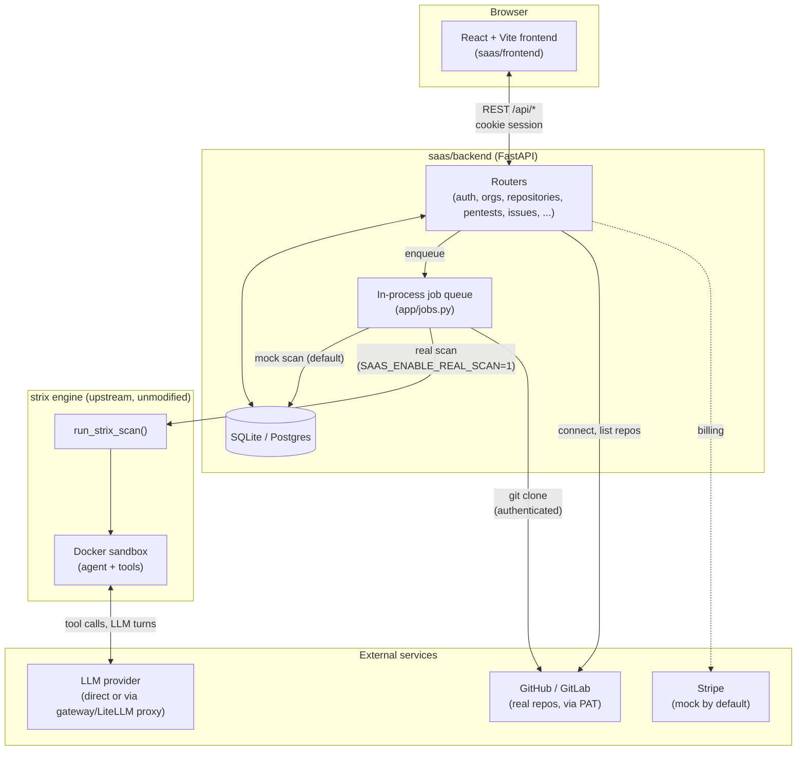
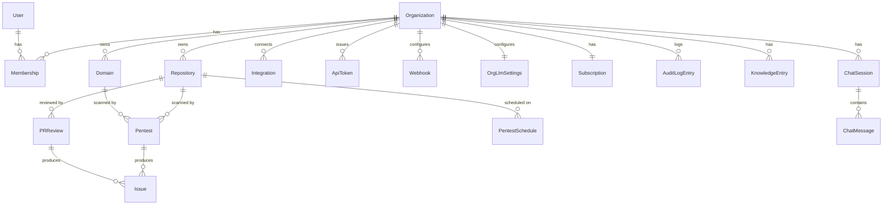
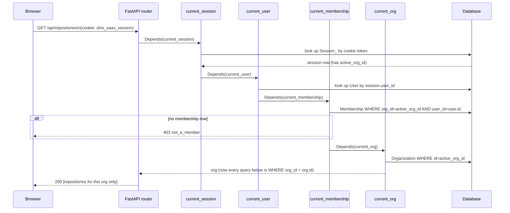
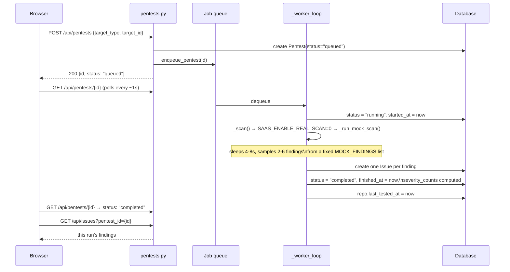
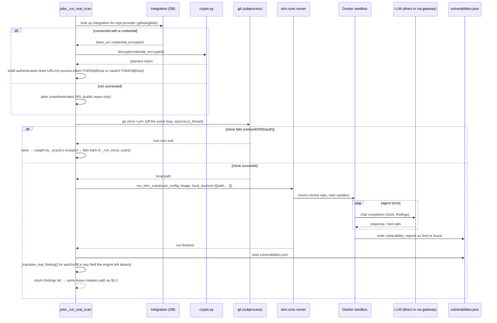
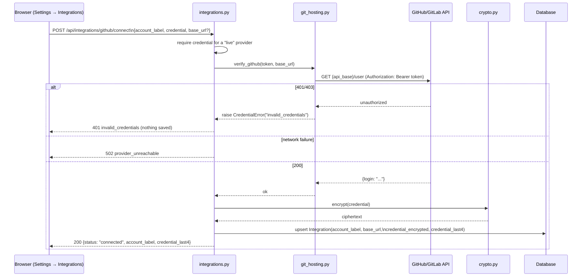
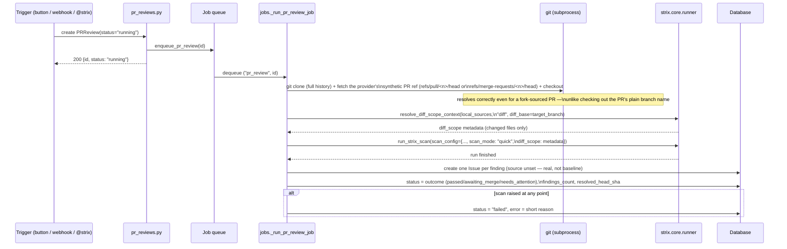
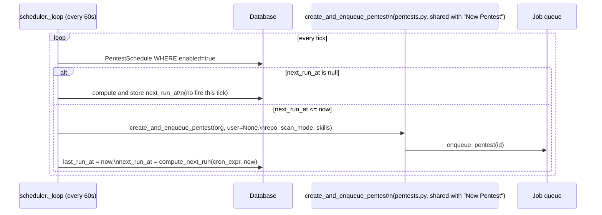
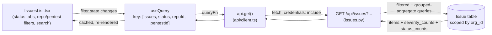

# Strix SaaS — Architecture & Design

This document describes the architecture of `saas/` — the multi-tenant
`app.strix.ai`-style dashboard built on top of the open-source `strix`
pentest engine. It covers system structure, the backend and frontend
designs, the data model, and the key request/data flows, including how a
pentest, a PR review, a scheduled scan, or a Chat request each go from a
UI action to a real, source-aware security scan.

For day-to-day setup and environment variables, see `saas/README.md` and
`saas/CONFIG.md`. For the feature-by-feature build log, see `saas/TASKS.md`.

## 1. Repository structure and the isolation boundary

This is a fork of [`usestrix/strix`](https://github.com/usestrix/strix). The
fork adds exactly one new top-level thing — `saas/` — and changes nothing
else, so it can keep merging `upstream/main` cleanly forever.

```
strix/                    # upstream pentest engine — untouched except for
                           # a handful of deliberate, documented exceptions (§8)
├── strix/                # the engine package (agents, runner, tools, config)
├── tests/                # upstream's own test suite
└── saas/                 # ← everything in this document lives here
    ├── backend/          # FastAPI control-plane API (own pyproject.toml)
    │   └── app/
    ├── frontend/          # React dashboard (own package.json)
    │   └── src/
    ├── dev.sh             # runs both together for local development
    ├── README.md          # setup instructions
    ├── CONFIG.md          # environment variables, mock-vs-real providers
    └── TASKS.md           # phase-by-phase build log
```

**Why this boundary matters:** `saas/backend` depends on the `strix`
package as a library (an optional `real-scan` extra in its
`pyproject.toml`, `path = "../.."` editable install) — it *calls into* the
engine to run real scans, but the engine has no idea `saas/` exists. This
means:

- `saas/` can sync with upstream `strix` changes indefinitely without merge
  conflicts, because upstream never touches `saas/` and `saas/` (almost)
  never touches upstream.
- The engine stays reusable by anyone (CLI, this SaaS, someone else's
  product) without SaaS-specific assumptions leaking into it.

## 2. System overview



Three things worth calling out up front, because they shape everything
below:

1. **Everything is multi-tenant and org-scoped.** There is no concept of a
   "global" repository, issue, or pentest — every row in the database
   carries an `org_id`, and every API route resolves the caller's active
   org from their session before touching data (§5).
2. **Mock-first, real behind a flag.** Every integration that needs
   external credentials (real pentest execution, GitHub/GitLab, Stripe,
   outbound email) has a working mock implementation by default, so the
   whole product is clickable with zero configuration. Flipping a setting
   swaps in the real implementation without touching calling code — see
   §7 and `saas/CONFIG.md`.
3. **The job queue is intentionally single-worker.** One `asyncio.Queue`
   plus one consumer task processes pentests *and* real PR reviews
   strictly one at a time, sharing the same worker (§3.2). This is not a
   scaling limitation that got missed — it's a chosen constraint that
   makes per-org LLM credential swapping via process env vars safe (§6.3).
   Parallelizing it later requires solving that isolation problem first
   (e.g. one subprocess per scan).

## 3. Backend architecture

**Stack:** FastAPI, SQLAlchemy 2.0 (`Mapped`/`mapped_column` style), SQLite
by default (`SAAS_DATABASE_URL` repoints to Postgres with no code change),
Pydantic for request/response models, cookie-based sessions.

### 3.1 Directory layout

```
saas/backend/app/
├── main.py           # FastAPI app, lifespan (DB init + job worker), CORS
├── settings.py        # pydantic-settings, all env vars prefixed SAAS_
├── db.py              # engine/session factory
├── models.py           # every SQLAlchemy entity (§4)
├── schemas.py          # a few shared Pydantic response shapes
├── deps.py             # FastAPI dependencies: auth + org-scoping (§5)
├── crypto.py            # Fernet encryption for stored credentials
├── time_utils.py         # utcnow() helper
├── cron.py                # croniter wrapper for PentestSchedule (§6.6)
├── run_logs.py             # shared strix.log parser (pentests + PR reviews)
├── standard_skills.py       # allowlisted OWASP/PCI/NIST skill catalog (§6.3)
├── jobs.py               # async job queue + pentest/PR-review execution (§6, §7)
├── scheduler.py            # periodic checker that fires due PentestSchedules (§6.6)
├── seed.py                # idempotent demo-data seeder
├── providers/
│   ├── github.py           # GitHub *App* scaffold (PR check-runs; dormant, see §8)
│   ├── git_hosting.py       # real GitHub/GitLab REST calls (PAT-based, §7.2)
│   └── billing.py            # mock/real Stripe behind one interface
└── routers/                   # one module per resource, one APIRouter each
    ├── auth.py                  # OTP login/session
    ├── orgs.py, members.py       # org CRUD, invitations, roles
    ├── repositories.py, domains.py
    ├── integrations.py            # GitHub/GitLab/Bitbucket/Slack/Jira/Linear connect
    ├── pentests.py, issues.py      # scan lifecycle, findings, schedules (§6.6)
    ├── pr_reviews.py                # PR review trigger + settings + webhook + report/logs
    ├── knowledge.py, chat.py         # knowledge base, chat (now triggers real scans, §6.7)
    ├── tokens.py, webhooks.py         # API access settings
    ├── billing.py, llm_settings.py    # subscription, per-org LLM config
    └── audit.py                        # activity log
```

Every router follows the same shape: a `_serialize()` function that turns
an ORM row into a plain dict, list/get/create/update/delete endpoints that
depend on `current_org` (and `require_admin` where the action is a
security-posture change — §5.2), and an `_record_audit()` call on
state-changing actions.

### 3.2 The job queue (`app/jobs.py`)

One shared queue, one worker, two job types — a pentest and a real PR
review both go through it, tagged so the worker can dispatch to the right
handler:

```python
_queue: asyncio.Queue[tuple[str, str]] | None = None   # (job_type, entity_id)
_worker_task: asyncio.Task | None = None

async def _worker_loop() -> None:
    while True:
        job_type, entity_id = await _queue.get()
        try:
            if job_type == "pentest":
                await _run_pentest(entity_id)
            else:
                await _run_pr_review_job(entity_id)
        except Exception:
            logger.exception(...)   # a broken job must not kill the worker
        finally:
            _queue.task_done()
```

`POST /api/pentests` creates a `Pentest` row (`status="queued"`) and calls
`enqueue_pentest(id)`; the worker picks it up, sets `status="running"`,
calls `_scan()`, and on success creates one `Issue` row per finding and
sets `status="completed"` — or, on *any* exception anywhere in that
process (bad finding shape, scan crash, clone failure), rolls back and
sets `status="failed"`. A pentest can never get stuck in `"running"`
forever — see the sequence diagrams in §6.

**Why one queue, not two:** `_run_real_scan`'s per-org LLM credential swap
(§6.3) mutates process-wide env vars and is only safe because exactly one
scan runs at a time in this process. A separate PR-review worker would let
a pentest and a PR review race on that same global state — so PR reviews
share the pentest worker's queue rather than getting their own (§6.5).

A third, independent background task — `app/scheduler.py` — wakes up
every 60s, finds every enabled `PentestSchedule` whose `next_run_at` has
passed, and calls the exact same `enqueue_pentest`-backed creation path a
manual "Run pentest" click uses (§6.6). It doesn't touch the job queue's
internals; it's just another caller of `create_and_enqueue_pentest`.

## 4. Data model



Notes on a few entities that aren't self-explanatory:

- **`Membership`** is the only place a `User` connects to an `Organization`
  — role (`admin`/`member`) lives here, not on the user. A user can belong
  to multiple orgs; `Session_.active_org_id` tracks which one is "current."
- **`Integration`** (one row per org+provider) holds real, per-org
  GitHub/GitLab credentials: `account_label`, `base_url` (self-hosted
  support), `credential_encrypted` (Fernet, via `app/crypto.py`), and
  `credential_last4` (plaintext, display-only). See §7.2.
- **`Issue.repository_id` / `Issue.domain_id` / `Issue.pentest_id` /
  `Issue.pr_review_id`** are all nullable FKs — an issue is always attached
  to exactly one target (repo or domain) and exactly one source (a pentest
  run or a PR review), never both sources at once. `Issue.source` is a
  separate, unrelated field: `"baseline_scan"` for a Tier 3 deterministic
  finding (see `docs/strix-engine-architecture.md` §5.2) or `null` for
  everything an agent filed — independent of which of the FKs above is set.
- **`Pentest.custom_instructions`** — free text folded into the scan's
  root task as strix's `user_instructions` (§6.7); null for a normal New
  Pentest, set for a Chat-triggered one. **`Pentest.skills`** /
  `PentestSchedule.skills` — the standards-coverage skills to preload on
  the root agent (§6.3), an allowlisted JSON list defaulting to
  `["owasp_top_10"]`, validated by `app/standard_skills.py`.
- **`PentestSchedule.cron_expr`/`last_run_at`/`next_run_at`** — a standard
  5-field cron expression and the bookkeeping `app/scheduler.py` (§6.6)
  needs to know what's due; `next_run_at` is computed at creation and after
  every fire, not left for a tick to backfill lazily.
- **`PRReview.status`** now includes `"running"` (the default on create —
  a real scan takes minutes, so a review starts running in the background,
  not with an immediate result) and `"failed"` (a real-scan error, with
  `PRReview.error` holding a short reason) alongside the four outcome
  statuses. `target_branch`/`resolved_head_sha` record what was actually
  diffed/scanned, same reproducibility rationale as `Pentest.ref`/
  `resolved_commit_sha`. See §6.5.
- **`OrgLlmSettings`** is a per-org override of the model/API key/API base
  a real scan uses — see §6.3 for why swapping it is safe only because the
  job queue is single-worker.

## 5. Multi-tenancy and auth

### 5.1 Session and org resolution



Every dependency in that chain (`app/deps.py`) is a small, composable
FastAPI `Depends()` — a router that needs the org just declares
`org: Organization = Depends(current_org)` and every query it writes
naturally starts with `.filter_by(org_id=org.id)`. There is no separate
"tenant middleware" layer; the scoping is structural, at the query level,
in every router.

### 5.2 Admin vs. member authorization

A second dependency, `require_admin`, gates **security-posture** actions —
anything that changes what the org is exposed to, not day-to-day usage:

| Admin-only | Member-accessible |
|---|---|
| Create/revoke API tokens | Run a scan, add a repo/domain |
| Create/delete webhooks | View issues, trigger PR reviews |
| Change PR-review blocking policy | Chat, add knowledge entries |
| Remove a connected repo/domain | Verify domain ownership |
| Create/toggle/delete scheduled scans | — |
| Connect/disconnect an integration | — |

This split was the single most-corroborated finding from an internal
code-review pass early on — a member silently disabling a scheduled scan
or exfiltrating data via a new webhook would remove security coverage
without anyone noticing, so those actions need `require_admin`.

## 6. Key flows

### 6.1 OTP login

```mermaid
sequenceDiagram
    participant B as Browser
    participant API as auth.py
    participant DB as Database

    B->>API: POST /api/auth/otp/start {email}
    API->>DB: create OtpCode(email, code, expires_at, attempts=0)
    alt SAAS_DEV_MODE=1 (default)
        API-->>B: 200 {ok: true, dev_code: "123456"}
    else production
        API--)B: (code emailed, not returned)
    end
    B->>API: POST /api/auth/otp/verify {email, code}
    API->>DB: most recent unconsumed OtpCode for email
    alt code wrong
        API->>DB: attempts += 1
        API-->>B: 403 invalid_or_expired_code
    else attempts >= 5
        API->>DB: consumed = true
        API-->>B: 429 too_many_attempts
    else correct
        API->>DB: consumed = true; find/create User; create Session_
        API-->>B: 200 {user, active_org, role} + Set-Cookie
    end
```

### 6.2 Triggering a pentest (mock path — the default)



### 6.3 Real pentest execution

This is the path behind `SAAS_ENABLE_REAL_SCAN=1` — genuine source-aware
analysis, not canned findings. It reuses the exact same job-queue shape as
§6.2; only `_scan()`'s branch changes.



Two properties this design deliberately preserves:

- **Graceful degradation at every step.** A clone failure, a Docker
  failure, an LLM auth failure, a missing model config — all of them are
  caught by `_scan()`'s outer `except Exception`, logged, and fall back to
  the mock scanner. The pentest always reaches a terminal state
  (`completed` via mock, or `failed` if even mock somehow raised); it
  never hangs.
- **Per-org LLM credentials via env vars, safely.** If the org has
  `OrgLlmSettings` configured, `_run_real_scan` sets `STRIX_LLM` /
  `LLM_API_KEY` / `LLM_API_BASE` as process env vars immediately before
  calling into the engine (invalidating the engine's memoized settings
  cache), and restores the previous values in a `finally` block. This is
  the *only* override surface the engine exposes — there's no per-call
  `api_key` parameter anywhere in `run_strix_scan`. It's safe only because
  the job queue processes one scan at a time; parallelizing it would let
  two orgs' credentials race.

`scan_config` also carries two more real, engine-level inputs beyond the
target itself: `"skills"` — the New Pentest / schedule modal's
standards-coverage picker (`app/standard_skills.py`'s
`to_engine_skills(pentest.skills)`, qualifying an allowlisted name like
`owasp_top_10` to `standards/owasp_top_10` — see
`docs/strix-engine-architecture.md` §2), defaulting to `["owasp_top_10"]`
when nothing was picked — and `"user_instructions"` —
`pentest.custom_instructions`, set only for a Chat-triggered pentest
(§6.7), null otherwise.

### 6.4 Connecting a real GitHub/GitLab integration



The same connected `Integration` row is what §6.3 decrypts to authenticate
a real `git clone`, and what `GET /api/repositories/installable` decrypts
to list an org's *real* repos (`GET /user/repos` / `GET
/projects?membership=true`) instead of a fixed mock catalog. Repo,
branch/tag/commit, and pull/merge-request listing all follow the
provider's own pagination (`git_hosting.py`'s `_get_all_pages_github`/
`_get_all_pages_gitlab`, capped at 20 pages) rather than stopping at the
first page — a token with access to more than one page's worth of repos
used to silently disappear past page 1.

### 6.5 Real PR review execution

Unlike a pentest, a PR review has **no mock fallback at all** — triggering
one (the "Review a Pull Request" button, a GitHub webhook on PR open/push,
or an `@strix` PR comment) requires `SAAS_ENABLE_REAL_SCAN=1`; the manual
endpoint returns `400 real_scan_not_enabled` otherwise, and the webhook
skips with `{"skipped": "real_scan_not_enabled"}`. A triggered review is
created immediately with `status="running"` and enqueued on the pentest
worker's shared queue (§3.2) — never run inline in the request handler,
since a real scan takes minutes and would otherwise block the webhook
response past GitHub's delivery timeout.



Two things worth calling out:

- **Diff-scoped, not whole-repo.** The engine's own diff-scope mechanism
  (`strix.interface.utils.resolve_diff_scope_context` — the same one the
  strix CLI uses for `--scope-mode diff` in CI) narrows the scan to the
  PR's actually-changed files, diffed against `PRReview.target_branch` (or
  the repository's `default_branch` if the review wasn't triggered from a
  live PR picker). `scan_mode="quick"` on top of that keeps a chat-speed
  PR check fast.
- **A report and a run log exist per review**, same pattern as a pentest:
  `GET /api/pr-reviews/{id}/report` (HTML) / `.../report/download` (PDF)
  once `status` reaches a done state (never while `"running"` or
  `"failed"` — `409 report_not_ready`), and `GET /api/pr-reviews/{id}/logs`
  reads the same `strix.log` a pentest does (`app/run_logs.py`, shared
  between both routers — a PR review's `id` is the `scan_id`/`run_name`
  strix wrote it under, same as a pentest's).

### 6.6 Scheduled pentests

`app/scheduler.py` is a third background task (started/stopped from the
same FastAPI lifespan as the job worker), polling every 60s:



A scheduled fire reuses the exact same creation path a manual click uses
— same real-vs-mock branch, same `skills` selection — so there's no
separate "scheduled scan" code path to keep in sync. `Pentest.created_by`
is left null for a scheduler-fired run (there's no acting user).
Re-enabling a paused schedule recomputes `next_run_at` from *now* rather
than resuming from wherever it was paused, so a schedule paused for a week
doesn't immediately fire to "catch up." An org whose schedule's target
repository or org itself disappears is disabled automatically rather than
retried forever.

### 6.7 Chat triggers a real scan

Chat has no mock reply either — every assistant message is either a real
answer about what's happening, or nothing happens at all:

- **No repository attached** → the reply says so plainly ("I can't scan
  anything without a target. Click 'Add repositories'...") — no fabricated
  "I'll start a review."
- **Repositories attached, real scanning enabled** → one real `Pentest` is
  created per attached repository via the same `create_and_enqueue_pentest`
  helper §6.6 uses, with the chat message itself threaded through as
  `Pentest.custom_instructions` (folded into strix's root task as
  `scan_config["user_instructions"]` — a real engine-level input, not
  saas-side decoration) and `scan_mode="quick"`. The reply reports what
  was actually started (repo names + pentest ids), never a fabricated
  "found N issues" — a real scan takes minutes, so results land on the
  Pentests/Issues pages once it finishes, same as everywhere else.
- **Repositories attached, real scanning disabled** → the reply says so
  plainly instead of pretending to work.

The "Add repositories" affordance in the chat composer opens a picker over
the org's already-connected repositories (not the GitHub/GitLab
"installable" list — those are two different pickers, §6.4 vs. this one)
and attaches the selection as `repository_ids` on the next message.

## 7. The mock-vs-real provider pattern

Most things in this product that need credentials only the operator/org
can provide follow the same shape: a small interface, a `Mock*`
implementation that's the default, and a real implementation activated by
a setting — so the product is fully clickable with zero configuration, and
upgrading one integration to "real" never touches the routers or frontend
that use it. **PR reviews and Chat are the deliberate exception** — see
the note below the table.

| Integration | Mock (default) | Real, activated by |
|---|---|---|
| GitHub/GitLab repo access | N/A — real by default, per-org (§6.4) | `Integration.credential_encrypted` set (no global flag needed) |
| Pentest execution | `MockScanner` — canned findings, 4-8s | `SAAS_ENABLE_REAL_SCAN=1` + Docker + LLM creds (§6.3) |
| PR review execution | **None — no fallback** | `SAAS_ENABLE_REAL_SCAN=1`; disabled → the trigger is refused/skipped, not mocked (§6.5) |
| Chat-triggered scanning | **None — no fallback** | Same flag; a repo attached + flag on triggers a real `Pentest` (§6.7) |
| Billing | `MockBillingProvider` — flips `card_added` locally | `SAAS_STRIPE_SECRET_KEY` set |
| Outbound email (OTP/invites) | Code/token returned directly in the API response | `SAAS_DEV_MODE=0` + a `send_email()` call wired in |

PR reviews and Chat break the "mock by default" pattern on purpose: a
pentest's mock scanner exists so the *whole product* is clickable with
zero setup (dashboard, findings pages, report rendering, all exercisable
without Docker/LLM credentials) — but a mock reply from *these specific*
surfaces once looked and behaved like genuine scan output with no visible
seam, which is a worse failure mode than an honest "real scanning isn't
enabled" message. Both now refuse or state that plainly instead.

### 7.1 GitHub App vs. per-org PAT: two separate, intentional models

`app/providers/github.py` scaffolds a *different* GitHub integration model
— a single GitHub App registered once for the whole deployment, used for
posting PR-review check-runs/comments and receiving webhooks. It's real
code with a working mock, but the "real" half is deliberately left
unimplemented (`RealGitHubProvider` raises `NotImplementedError`) because
it needs a registered GitHub App only the deployment operator can create.

This is **not** the same thing as `app/providers/git_hosting.py` (§6.4),
which is per-org, PAT-based, and fully real. The two coexist on purpose:
PAT-based access is enough for real repo listing and real cloning; a
GitHub App is a separate, larger investment needed only for posting
results back into GitHub's UI. See `app/providers/github.py`'s module
docstring for the full reasoning.

### 7.2 Credential storage

Two different secrets are stored, both intentionally minimized:

- **`Integration.credential_encrypted`** — the *full* GitHub/GitLab token,
  Fernet-encrypted (`app/crypto.py`) with a key derived from
  `SAAS_CREDENTIALS_ENCRYPTION_KEY`. It's decrypted only at the moment a
  real API call or `git clone` needs it, never sent back to the browser.
  Only the last 4 characters are additionally stored in plaintext
  (`credential_last4`) purely for UI display.
- **`ApiToken.token_hash`** / **`Webhook.secret`** — API tokens and
  webhook signing secrets follow a stricter "shown once" pattern: the raw
  value is returned in the creation response only, never again, not even
  to an admin re-listing them later.

## 8. Deliberate exceptions to "never touch `strix/`"

§1's isolation boundary is a strong default, not an absolute rule: a
handful of `saas/`-motivated changes to the engine itself were made
knowingly, each accepted with the same tradeoff — the touched file may
need manual reconciliation on a future `upstream/main` sync — rather than
working around the engine from `saas/` in a way that would fight it. All
of them are additive (new functions/params/fields) rather than rewrites of
existing behavior, which keeps that reconciliation risk low in practice.

- **`strix/core/inputs.py`'s `make_model_settings()`** sends
  `parallel_tool_calls=False` on every real scan (any agent with tools). A
  LiteLLM-proxy-fronted provider without `litellm_settings: drop_params:
  true` in its own server config rejects the entire request for carrying a
  param outside its explicit support list — confirmed by hand with a raw
  `curl` completion against an affected gateway, which succeeded until
  `parallel_tool_calls` was added to the body. The fix — attaching
  `extra_body: {"allowed_openai_params": ["parallel_tool_calls"]}`, a
  client-side LiteLLM directive that needs no server-side config change —
  required editing the engine, not `saas/`.
- **The Tier 1-3 scan-coverage-determinism mitigations** (expanded
  mandatory-agent guidance in `strix/skills/coordination/root_agent.md`;
  `finish_scan`'s mandatory `coverage_checklist` gate in
  `strix/tools/finish/tool.py`; the pre-agent deterministic baseline scan
  in `strix/scan/baseline.py`) — see
  `docs/strix-engine-architecture.md` §5.2 and
  `docs/scan-coverage-tier3-plan.md`. Root cause: an LLM root agent left
  entirely to its own judgment produced wildly inconsistent coverage
  scanning the *same commit* run to run, observed directly against a real
  SaaS-triggered target before any of this existed.
- **Branch/tag/commit ref-pinning** (`clone_repository`'s `ref` parameter,
  returning the resolved commit SHA) — makes "the same pentest" actually
  reproducible; §6.3/§6.5 record the resolved SHA on `Pentest`/`PRReview`.
- **The `standards`/`vulnerabilities` skill catalog** (§6.3;
  `docs/strix-engine-architecture.md` §2) and the `--skill` CLI flag that
  exposes it, reusing the validation `create_agent` already had for a
  child agent's skill selection.

All were made after confirming no `saas/`-side or engine bug was the
actual cause, and none change existing behavior for a caller that doesn't
opt in (a plain `run_strix_scan()` call with no `skills`/`ref` and default
settings behaves as it did before all of the above existed).

## 9. Frontend architecture

**Stack:** React 19, Vite, React Router, TanStack Query (server state),
Zustand (client/session state), Tailwind (CSS-first config, theme tokens
adapted from the upstream viewer).

### 9.1 Directory layout

```
saas/frontend/src/
├── api/
│   ├── client.ts        # fetch wrapper: credentials:"include", ApiError class
│   └── types.ts          # one TS interface per backend resource
├── store/
│   └── session.ts          # Zustand: current user/org, login/logout/switchOrg
├── layout/
│   ├── AppShell.tsx           # auth gate + redirect, renders Sidebar + <Outlet/>
│   └── Sidebar.tsx              # nav, org switcher (locked/inert nav items removed,
│                                   # not left as unclickable dead links)
├── components/shared/            # Modal, Table pieces, FilterBar, StatusPill,
│                                   # Toast, Board, ViewToggle, Form primitives —
│                                   # built once, reused across every list page
├── pages/
│   ├── Auth/                       # Login (OTP), Onboarding (create first org)
│   ├── Dashboard/
│   ├── Repositories/, Domains/       # add/list/remove targets (repo picker paginates
│   │                                    # through every page of a connected account)
│   ├── Pentests/                       # trigger (target + skills picker), list,
│   │                                      # schedules modal, live-polling detail view
│   ├── Issues/                           # list (with repo/pentest filters), detail
│   ├── PRReviews/                          # trigger (live PR picker or manual entry),
│   │                                          # settings, list/board, live-polling
│   │                                          # detail view with report view/download
│   ├── Knowledge/, Chat/                       # Chat's "Add repositories" opens a
│   │                                              # real multi-select picker
│   ├── Integrations/                             # connect/disconnect providers
│   └── Settings/                                   # members, API access, billing,
│                                                       # LLM provider, audit log
└── test/                                              # render/mock-fetch test helpers
```

### 9.2 State management split

- **Server state → TanStack Query.** Every page's data (`repositories`,
  `pentests`, `issues`, ...) is a `useQuery` keyed by resource + active
  filters; mutations (`useMutation`) invalidate or directly patch the
  relevant query key on success. There is no separate Redux-style client
  cache for server data.
- **Client/session state → Zustand.** Only things that aren't "data from
  the API" live here: the current user/org (populated by `refresh()` on
  app load), and imperative actions like `switchOrg()`/`logout()` that
  need to trigger a refetch of everything else.
- **Errors are handled globally, once.** `main.tsx` wires a
  `MutationCache.onError` that shows a toast for every failed mutation
  app-wide — individual pages don't each need their own error-handling
  boilerplate.

### 9.3 Data flow for one page (e.g. Issues list)



## 10. Testing strategy

Both suites run against real infrastructure, not heavy mocking of the
system under test:

- **Backend** (`saas/backend/tests/`): pytest against a real per-test
  SQLite database and a real FastAPI lifespan (the job queue actually
  runs). External calls (GitHub/GitLab APIs, `strix.core.runner`) are
  mocked at the network boundary — via `httpx.MockTransport` for
  `git_hosting.py`, and a faked `strix` package for `jobs.py` — so the
  *request-building and response-parsing* logic is genuinely exercised,
  not just assumed. 100% line coverage, enforced at `fail_under=95`.
- **Frontend** (`saas/frontend/src/**/*.test.tsx`): Vitest + React Testing
  Library against every page/component, with `fetch` mocked per-URL.
  ~99.8% statement coverage, enforced via `vite.config.ts` thresholds.
- **What's not covered**: true end-to-end browser tests (Playwright/
  Cypress) clicking through the real rendered UI against the real
  backend — this environment has no headless-browser tool. Verification
  of real, cross-service behavior (real GitHub/GitLab API calls, real
  Docker sandbox execution, real LLM gateway routing) has instead been
  done by hand against the live stack — see the git history and
  `saas/TASKS.md` for what was verified this way and how.

## 11. Where to look next

- `saas/README.md` — local setup, `saas/dev.sh` usage
- `saas/CONFIG.md` — every environment variable, and the full mock-vs-real
  breakdown per integration
- `saas/TASKS.md` — phase-by-phase feature log, including what's
  explicitly out of scope and why
