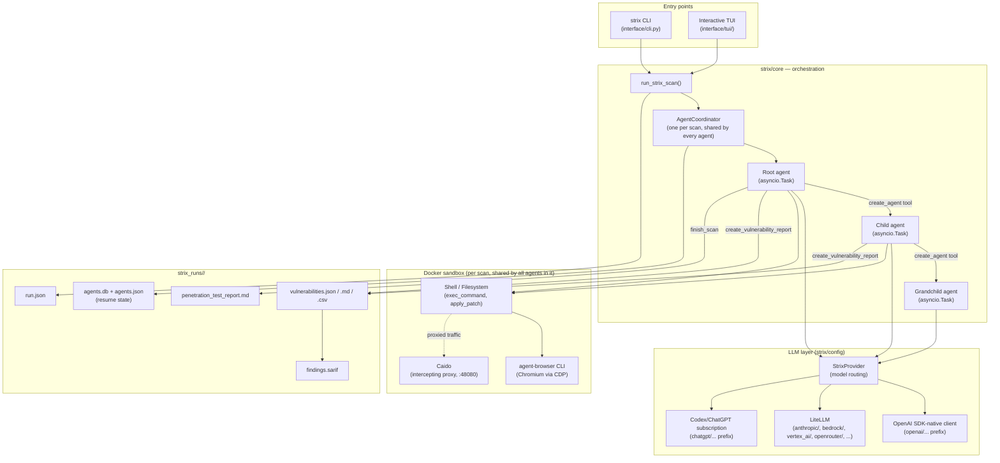
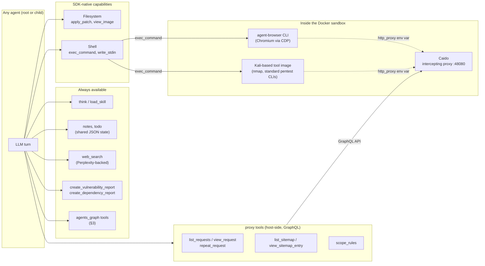

# Strix Engine — Architecture & Design

This document describes the architecture of the `strix` pentest engine
itself (the root of this repository — `strix/`, `tests/`, `docs/`), **not**
`saas/` (a separate multi-tenant dashboard built on top of this engine as
a library; see `docs/saas-architecture.md`). It focuses on how agents are
created and spawned, how the LLM layer is designed, the pentest tool/tech
stack, the sandbox runtime, reporting, and integrations.

Facts here are grounded directly in the source (file/function references
throughout). A few specifics that couldn't be fully verified are called
out explicitly in §10 rather than presented as certain.

## 1. What this engine does, in one picture

Strix runs one or more LLM-driven **agents** against a target (a
repository, a local codebase, a live web app, an IP, or an API spec)
inside an isolated **Docker sandbox** that bundles pentest tooling
(shell, browser automation, an intercepting proxy). Agents can spawn
specialist **child agents** to work in parallel, and every filed finding
is written immediately to disk so a scan is resumable and a partial run
still produces a usable report.



## 2. Agent creation

Every agent — root or child, at any depth — is built by the **same
function**: `build_strix_agent(...)` (`strix/agents/factory.py:562`),
returning one `agents.sandbox.SandboxAgent` (OpenAI Agents SDK). The only
inputs that differ between a root agent and a child are `is_root` and,
derived from it, the tool set:

| | Root agent | Child agent |
|---|---|---|
| Lifecycle tool | `finish_scan` | `agent_finish` |
| Orchestration prompt skill | `coordination/root_agent` (added only for root) | — |
| Everything else (base tools, `Filesystem`/`Shell` capabilities, model settings, `tool_use_behavior`) | identical | identical |

**Tools every agent gets** (`_BASE_TOOLS` + SDK capabilities, see §4 for
the full breakdown): `think`, `load_skill`, todo/notes tools, `web_search`,
reporting tools (`create_vulnerability_report`, `create_dependency_report`,
`list_reports`, `get_report`), Caido proxy tools, the multi-agent graph
tools (`view_agent_graph`, `send_message_to_agent`, `wait_for_agents`,
`create_agent`, `stop_agent`), plus `Filesystem` (`apply_patch`,
`view_image`) and `Shell` (`exec_command`, `write_stdin`). Interactive
scans additionally get `respond_to_user` on every agent — the user can
message any agent in the tree, not just the root.

`tool_use_behavior` is a custom hook: a turn only ends when a lifecycle
tool (`agent_finish`/`finish_scan`) reports success, or — interactive only
— a "parking" tool (`respond_to_user`, `wait_for_agents`) reports it's
waiting. Plain text output never silently ends a turn; `_run_until_lifecycle`
(§3) enforces this with a bounded recovery loop.

**System prompts**: `render_system_prompt(...)` (`strix/agents/prompt.py:60`)
renders a Jinja2 template plus an assembled skill library
(`_resolve_skills`). Both root and child always get: any explicitly
requested skills, `scan_modes/<mode>`, `tooling/agent_browser`,
`tooling/python`; whitebox-mode scans add
`coordination/source_aware_whitebox` + `custom/source_aware_sast`. **Only
the root** gets `coordination/root_agent` — the prompt-level nudge toward
delegating to specialists rather than doing everything itself. (The
`is_root`/`interactive` flags are also passed into the template directly,
so the `.jinja` file itself may branch further — not fully verified, see
§10.)

**Requested skills are validated the same way for the root and for a
spawned child.** `strix/skills/__init__.py`'s `validate_requested_skills(names, max_skills=5)`
rejects more than 5 names, an unknown name, or a bare (non-category-qualified)
name that's ambiguous across categories — the exact check `create_agent`
already ran for a child's `skills` argument (§3) is reused for the root
agent's own preloaded skill list, requested via the CLI's `--skill NAME`
flag (repeatable; persisted across `--resume`, see §8.1) or a library
caller's `scan_config["skills"]`.

Beyond the always-loaded skills above, `strix/skills/` ships a curated,
selectable catalog meant for this validated-selection path rather than
automatic loading:

| Category | Skills | What they do |
|---|---|---|
| `standards/` | `owasp_top_10`, `owasp_asvs`, `owasp_api_top_10`, `pci_dss`, `nist_ssdf` | A compliance/standards coverage map — nudges the root agent to spawn one specialist per testable category/control family from that standard, rather than leaving coverage entirely emergent. |
| `vulnerabilities/` | `cryptographic_failures`, `security_misconfiguration`, `session_management`, `unrestricted_resource_consumption` | Deep-dive guidance for one specific vulnerability class, for a targeted scan rather than a broad standard. |

`saas/backend/app/standard_skills.py` keeps its own small allowlist of the
`standards/` names (so mock-mode pentests work without the optional
`real-scan` extra installed) and maps a SaaS `Pentest`/`PentestSchedule`'s
selected skills to `scan_config["skills"]` at real-scan time — see
`docs/saas-architecture.md` §6.3.

## 3. Spawning and the agent-tree execution model

Spawning is **entirely tool-driven** — nothing spawns automatically.

```mermaid
sequenceDiagram
    participant LLM as Root agent's LLM turn
    participant T as create_agent tool
    participant Coord as AgentCoordinator
    participant Ex as execution.spawn_child_agent
    participant Fac as child factory\n(make_child_factory closure)
    participant Sess as SQLiteSession (agents.db)
    participant Loop as _child_loop()\n(new asyncio.Task)

    LLM->>T: create_agent(name, task, skills, inherit_context=true)
    T->>T: validate skills (max 5)
    T->>Ex: context["spawn_child_agent"](...)
    Ex->>Ex: child_id = uuid.hex[:8]
    Ex->>Fac: factory(name, skills)
    Fac-->>Ex: SandboxAgent (is_root=False)
    Ex->>Coord: register(child_id, parent_id, task, skills)\nstatus="running"
    Ex->>Sess: open_agent_session(child_id, agents.db)
    Ex->>Loop: asyncio.create_task(_child_loop())
    Ex-->>T: {success, agent_id, message: "running in parallel"}
    T-->>LLM: tool result (does NOT block on the child)

    Note over Loop: independently runs run_agent_loop()\nsame event loop, concurrent with root

    LLM->>LLM: (optionally) wait_for_agents tool\nparks until a mailbox message arrives

    Loop->>Loop: ...does its own tool-use turns...
    Loop->>Coord: agent_finish → send(parent_id, report)
    Coord-->>LLM: message delivered to root's mailbox\n(interrupts an in-flight turn if configured)
```

Key properties, all confirmed in `strix/core/execution.py` and
`strix/core/agents.py`:

- **Concurrency model**: every agent — root and every descendant, at any
  depth — is a separate `asyncio.Task` in **one process, one event loop**.
  Not a subprocess, not a thread, not a remote worker. `create_agent`
  returns immediately; the parent is never blocked waiting on the child
  unless it explicitly calls `wait_for_agents`.
- **No enforced depth limit.** A child can call `create_agent` itself to
  spawn a grandchild; nesting is bounded only by turn/budget economics and
  the fact that only the root gets the orchestration-nudging prompt skill
  — there is no `MAX_DEPTH` constant in code.
- **No enforced concurrency limit.** No semaphore caps how many children
  can run at once; the practical ceiling is the shared cost budget
  (`max_budget_usd`) and per-turn tool-call limits
  (`LLM_MAX_TOOL_CALLS_PER_TURN`, default 32) — not agent count.
- **Coordination is mailbox-based, not return-value-based.**
  `AgentCoordinator.send()` queues a message into a target agent's
  mailbox and, if that agent has an in-flight stream and
  `interrupt_on_message` is set, cancels the stream immediately so the
  message is processed right away. `consume_pending()` drains the mailbox
  into the target's own SDK session. There is no other channel between
  parent and child tasks.
- **`AgentCoordinator`** (`strix/core/agents.py`) is the single
  lock-guarded object tracking *all* state across the whole tree in flat
  dicts (`statuses`, `parent_of`, `names`, `mailboxes`, `wait_kinds`, live
  `runtimes` — session/task/stream per agent). It snapshots itself to
  `agents.json` after nearly every mutation, which is what makes
  `--resume` possible: on resume, `respawn_subagents()` walks the restored
  graph and rebuilds every non-terminal agent via the same factory,
  reopening its existing `SQLiteSession` so the SDK naturally replays its
  conversation history.
- **Sessions**: every agent — root and each child — gets its own
  `agents.memory.SQLiteSession` (`strix/core/sessions.py`,
  `open_agent_session`), all backed by the same `agents.db` file, keyed by
  `agent_id`. This is the SDK-native conversation history mechanism, not
  a Strix-invented one; it's what makes per-agent resume work.
- **Budget/turn enforcement gates the whole tree, not spawning
  specifically.** `ReportUsageHooks` (`strix/core/hooks.py`) is created
  once per scan and shared by every agent's `Runner.run_streamed` call. On
  every LLM turn it checks accumulated scan-wide cost against
  `max_budget_usd`: at 100% it raises `BudgetExceededError` (stop
  everyone); for **non-root** agents specifically, at 90%
  (`_SUBAGENT_BUDGET_RESERVE`) it raises `SubagentBudgetReservedError` —
  child agents stop first, reserving the last 10% of budget for the root
  to finish and write its report. A budget-exhausted scan doesn't refuse
  new `create_agent` calls directly; a newly spawned child simply hits the
  same budget check on its very first cycle and stops immediately.

## 4. The pentest tool/tech stack



| Tool module | Gives the agent | How it's implemented |
|---|---|---|
| `shell/` | Terminal / shell execution | SDK-native `ShellTool` (`Shell` capability) — `exec_command`, `write_stdin` |
| `apply_patch/` | File editing | SDK-native `ApplyPatchTool` (`Filesystem` capability), surfaced as `patch` |
| `view_image/` | Screenshot/image viewing | SDK-native `ViewImageTool` (`Filesystem` capability) |
| `agent_browser/` | Browser automation | **Not a Python tool** — the `agent-browser` npm CLI, installed in the sandbox image, driven via `exec_command`. Real Chromium over CDP, not a mocked/aspirational feature. |
| `proxy/` | HTTP interception & replay | **Caido** (commercial-grade proxy, not mitmproxy), running as an in-container sidecar. Host-side function tools (`caido_api.py`) drive it over GraphQL via `caido-sdk-client`, one client per scan behind an `asyncio.Lock`. All shell/browser traffic is routed through it via `http_proxy`/`https_proxy`/`ALL_PROXY`. |
| `reporting/` | Filing findings | `create_vulnerability_report` (PoC-backed, CVSS-scored via the `cvss` library) and `create_dependency_report` (SCA/known-CVE findings) — extremely detailed docstrings act as the model-facing spec (CVSS calibration, CWE lists, dedup rules). |
| `agents_graph/` | Multi-agent orchestration | See §3. |
| `notes/`, `todo/` | Shared scratch memory / task tracking | In-memory, mirrored to `notes.json`/`todos.json` in run state — visible across every agent in the scan. |
| `web_search/` | Research | Perplexity-backed, security-focused system prompt. |
| `load_skill/` | On-demand prompt-library loading | Pulls markdown skill docs into context (the same skill library used to assemble system prompts, §2). |
| `finish/`, `respond/`, `thinking/` | Lifecycle / user interaction / private reasoning | `finish_scan` (root-only), `respond_to_user` (interactive-only), `think` (no side effects). |

**Oversized tool output** is bounded before it ever enters an agent's
message history (`strix/tools/output_store.py`): results are truncated to
a head+tail preview, with the full text optionally spilled to
`/workspace/.tool-output/<uuid>.txt` inside the sandbox — the agent is
told the path and can read the rest with its own file/shell tools rather
than flooding context.

## 5. Sandbox runtime

**Execution model — the agent does not run inside the container.** The
Python agent process (LLM loop, `strix/core/*`) runs on the host. The
Docker container hosts only the tool image (Kali-based) plus a
filesystem/shell "session" the OpenAI Agents SDK talks to via an
exec/attach bridge. `exec_command`/`apply_patch`/`view_image` are RPCs
into that container session, not code running inside it. This is a
host-orchestrator + container-sandbox split.

**One sandbox session per scan, shared by every agent in it.**
`strix/runtime/session_manager.py`'s `create_or_reuse(scan_id, ...)`
caches the built session (`{"client", "session", "caido_client"}`) keyed
by `scan_id`, so the root agent and every child it spawns share the same
container and the same Caido proxy instance.

**Backends**: `RuntimeSettings.backend` (`STRIX_RUNTIME_BACKEND`, default
`"docker"`) is a free-form string, but `"docker"` is the only backend
registered out of the box (`_BACKENDS = {"docker": _docker_backend}` in
`strix/runtime/backends.py`). `register_backend(name, backend,
supports_bind_mounts=...)` is an explicit extension point for a downstream
project to plug in a different runtime (e.g. a remote sandbox provider)
before the first session is created — `get_backend` raises on an unknown
name rather than silently falling back.

**Docker specifics** (`StrixDockerSandboxClient` in
`strix/runtime/backends.py`/`docker_client.py`, a subclass of the SDK's
own Docker client): preserves the image's real entrypoint
(`docker-entrypoint.sh`, so Caido actually starts, instead of the SDK
default of overriding with `tail`); adds `NET_ADMIN`/`NET_RAW`
capabilities (needed for e.g. `nmap -sS` and raw sockets); maps
`host.docker.internal`; supports optional resource caps
(`STRIX_SANDBOX_MEM_LIMIT`/`_SHM_SIZE`/`_CPUS`/`_PIDS_LIMIT`) and a custom
Docker network (`STRIX_DOCKER_SANDBOX_NETWORK`).

**Target mounting**: for a `repository`/`local_code` target, the source
tree is exposed as a Docker bind mount at `/workspace/<subdir>` (the
default `writable` for local code, since the agent may propose fixes;
read-only metadata mounts for `.git`/`.agents`/`.codex`). Non-bind-mount
backends instead pack the same content into the SDK's `Manifest` as
in-memory `LocalDir`/`File` entries.

### 5.1 On-disk run layout

```
strix_runs/<run_name>/
├── run.json                    # status, targets_info, scan_mode, diff_scope,
│                                #   llm_usage snapshot, final scan_results
├── vulnerabilities.json         # full list of filed findings — source of
│                                #   truth for resume/dedup
├── vulnerabilities.csv           # flat severity-sorted index
├── vulnerabilities/
│   └── vuln-0001.md                # one rendered Markdown report per finding
├── baseline/                           # raw tool output from §5.2's baseline scan
│   ├── trivy.json                        # (present only for whitebox targets;
│   ├── gitleaks.json                     #  one file per tool that actually ran —
│   └── kube-linter.json                  #  a skipped/missing tool writes nothing)
├── findings.sarif                    # SARIF 2.1.0 — always emitted, even empty
├── penetration_test_report.md          # executive report (root's finish_scan)
└── .state/
    ├── agents.db                       # one SQLite conversation table per agent
    ├── agents.json                      # AgentCoordinator graph snapshot (resume)
    ├── notes.json, todos.json            # shared scratch state
    └── extra_files/                       # staged workspace_files
```

**Resume** (`strix --resume RUN_NAME`): requires `agents.json` to exist
(the run reached its first agent snapshot). `run.json` is re-read for
target/instruction/scope; `ReportState.hydrate_from_run_dir()` restores
prior vulnerability reports (and **raises**, rather than silently
resetting, on a corrupt `vulnerabilities.json` — a corrupt file could
otherwise let a fresh run reallocate a colliding `vuln-0001` id and
overwrite a prior finding's Markdown on disk); `respawn_subagents()`
rebuilds every non-terminal agent from the coordinator snapshot and
reopens its existing `SQLiteSession`, which the SDK replays automatically.
The baseline scan itself is **not** re-run on resume (`run_strix_scan`
only invokes it when `not is_resume`) — its findings are already in
`vulnerabilities.json` from the original run.

### 5.2 Baseline scan (pre-agent, deterministic)

Before the root agent's first turn, `run_strix_scan` (`strix/core/runner.py`)
runs a harness-driven, tool-based scan against the already-resolved
`local_sources` — the same host-filesystem paths a whitebox target's
source tree lives at, before the sandbox even exists. This is not an
agent tool call; nothing here goes through the LLM. See
`docs/scan-coverage-tier3-plan.md` for the full design rationale (it
exists because letting an LLM root agent decide, per run, whether to
spawn a dependency/secrets/IaC agent produced wildly inconsistent
coverage — the same commit scanned three times produced three different
finding sets).

`strix/scan/baseline.py`'s `run_baseline_scan(local_sources, timeout)`
wraps three tools, one per mechanically-checkable coverage category:

| Category         | Tool          | What it covers                                            |
|-------------------|---------------|-------------------------------------------------------------|
| `dependencies`     | `trivy fs`    | Known-CVE package versions across every lockfile in the tree (a monorepo's per-workspace lockfiles are picked up automatically — trivy walks the full tree) |
| `secrets`          | `gitleaks`    | Credential/key exposure, **including full git history** (`gitleaks detect`), not just the working tree |
| `infrastructure`   | `kube-linter` | Kubernetes/IaC manifest misconfiguration                    |

Each tool is optional at runtime: a missing binary, a timeout, a crash,
or unparseable output degrades to zero findings for that category and a
logged warning (`BaselineResult.skipped_tools`) — a baseline-scan problem
never aborts or blocks the rest of the scan. Findings are normalized into
`BaselineFinding`s and filed through the same `ReportState.add_vulnerability_report()`
every agent-filed finding uses, tagged `source="baseline_scan"` and
`coverage_category=<dependencies|secrets|infrastructure>` — indistinguishable
in shape from an agent-filed finding to every downstream consumer
(SARIF, `vulnerabilities.json`, the saas Issue pipeline), just with two
extra optional keys for provenance. Raw per-tool output is also persisted
to `run_dir/baseline/*.json` for audit.

Two integration points close the loop with the agent layer:

- A short summary (`BaselineResult.summary_text()`) is injected into the
  **root agent's** system prompt only (`extra_system_prompt_context`'s
  `baseline_scan_summary` key, rendered in `system_prompt.jinja`), so the
  root agent knows from turn one what's already been found and doesn't
  waste an agent rediscovering it from scratch.
- `finish_scan` (`strix/tools/finish/tool.py`) cross-checks the root
  agent's mandatory `coverage_checklist` notes for `dependencies`,
  `secrets`, and `infrastructure` against `ReportState.get_baseline_finding_counts()`:
  if the baseline scan found N findings in one of those categories, the
  agent's checklist note for that category must cite the exact count, or
  `finish_scan` rejects the call. This closes a gap the checklist alone
  couldn't: a plausible-but-false "nothing found" note used to pass
  Tier 2's length/emptiness check unchallenged.

Controlled by `BaselineSettings` (§6.2): `STRIX_BASELINE_SCAN` (default
on) and `STRIX_BASELINE_TIMEOUT` (per-tool timeout, default 180s). Runs
only when there's something to scan (`local_sources` non-empty) and only
on a fresh run, not a resume.

## 6. The LLM layer

### 6.1 Model routing

`StrixProvider` (`strix/config/models.py:448`, an `agents.MultiProvider`
subclass) is the single dispatch point for "given a `provider/model`
string, which client actually makes the call":

```mermaid
flowchart TD
    START["Model string, e.g. STRIX_LLM"] --> CHECK{"starts with\nchatgpt/ ?"}
    CHECK -->|yes| CODEX["Codex/ChatGPT subscription route\n(_CodexResponsesModel,\nOAuth, no API key)"]
    CHECK -->|no| CHECK2{"prefix is\nopenai/ or bare?"}
    CHECK2 -->|yes| NATIVE["SDK-native OpenAI client\n(openai_chatcompletions.py /\nopenai_responses.py)"]
    CHECK2 -->|no| CHECK3{"prefix is\nlitellm/ or any-llm/?"}
    CHECK3 -->|yes| LITELLM["LiteLLM\n(prefix stripped, passed through)"]
    CHECK3 -->|no| CHECK4{"prefix is\nollama/ ?"}
    CHECK4 -->|yes| OLLAMA["LiteLLM as\nollama_chat/<model>"]
    CHECK4 -->|no| OTHER["LiteLLM, original prefix preserved\n(anthropic/, bedrock/, vertex_ai/,\ngemini/, openrouter/, deepseek/, ...)"]

    NATIVE --> WRAP["_TurnGuardModel wrapper\n(applied to every route)"]
    LITELLM --> WRAP
    OLLAMA --> WRAP
    OTHER --> WRAP
    CODEX -.->|bypasses the wrapper stack entirely| DONE
    WRAP --> DONE["Model object used for this scan"]
```



Every non-codex route is wrapped uniformly in `_TurnGuardModel`, which:
dedupes/rewrites tool-call ids that collide across turns, caps tool calls
per response (`LLM_MAX_TOOL_CALLS_PER_TURN`, default 32), and enforces a
stream-idle timeout (`LLM_STREAM_IDLE_TIMEOUT`, default 300s) so a stalled
SSE stream fails instead of hanging the agent forever.

**Whether native or chat-completions tool schema is used**
(`uses_chat_completions_tool_schema`) matters because only OpenAI's real
Responses API accepts the SDK's richer native tool format — every
LiteLLM-routed provider, and any custom `api_base` (self-hosted/gateway),
gets the plain JSON chat-completions tool schema instead.

**One API key, many providers**: when `LLM_API_KEY`/`OPENAI_API_KEY` is
set, `_mirror_api_key_to_provider_env` (`strix/config/models.py:576`)
calls `litellm.validate_environment(model=...)` to discover which
provider-specific env var LiteLLM actually expects for that model (e.g.
`ANTHROPIC_API_KEY`, `GEMINI_API_KEY`) and mirrors the single supplied key
into it — so configuring one key covers whatever provider the model
string names, without the user needing to know LiteLLM's internal env var
naming.

### 6.2 Settings and precedence

`load_settings()` (`strix/config/loader.py:29`) is memoized
(`_cached: Settings | None`, module-level). Precedence is resolved
**per-field**, not per-section: for each `Settings` field, if any of its
pydantic env-var aliases is present in the environment, the JSON config
file's value for that field is skipped entirely; otherwise the JSON
value (from `~/.strix/cli-config.json` by default, or a path set via
`apply_config_override(path)`) is used as an explicit override of that
field's hardcoded default. So: **env vars > JSON config file > field
defaults**, decided independently per field. There is no TTL or
file-watcher — cache invalidation is manual (`apply_config_override` or
directly resetting `loader._cached = None`, which is what `saas/`'s
`_run_real_scan` does when applying per-org LLM overrides — see
`docs/saas-architecture.md` §6.3).

`Settings` composes several sub-models worth knowing: `LlmSettings`
(model, api_key, api_base, reasoning_effort, timeouts, tool-call caps),
`DedupeSettings` (a *separate*, independent model/key/base used only for
vulnerability-dedup LLM calls), `ContextSettings` (compaction/tool-output
bounding knobs), `RuntimeSettings` (sandbox image/backend),
`BaselineSettings` (§5.2's pre-agent baseline scan — enable flag and
per-tool timeout), plus telemetry/integration/viewer settings.
`max_turns`/`max_budget_usd` are **not** persisted settings — they're
plain CLI-supplied parameters to `run_strix_scan(...)`
(`DEFAULT_MAX_TURNS = 500`).

### 6.3 What every LLM call carries

`make_model_settings(...)` (`strix/core/inputs.py:241`) builds one
`ModelSettings` object used for every call in the scan (root and every
child alike — there's no per-agent override). Notably:

- `parallel_tool_calls=False` when the agent has tools — tool calls are
  deliberately serialized, with `extra_body={"allowed_openai_params":
  ["parallel_tool_calls"]}` attached so a strict LiteLLM-proxy-fronted
  provider (one without `drop_params: true` in its own server config)
  doesn't reject the request just for carrying that field explicitly.
- **Prompt caching**: only for Claude models (`is_claude_model`), via
  LiteLLM's `cache_control_injection_points` — a breakpoint on the system
  prompt and a rolling breakpoint on the latest message every turn; on
  Bedrock, an additional tool-config breakpoint, but only if that specific
  Bedrock-routed model is confirmed to support it (unsupported models
  reject the field outright). This only takes effect through the LiteLLM
  route, since every Claude-family prefix (`anthropic/`, `bedrock/`,
  `vertex_ai/claude-...`) routes there, never through the SDK-native
  OpenAI path.
- `reasoning_effort="max"` is sent as a raw `extra_body` field rather than
  the SDK's typed `Reasoning` enum, since `"max"` isn't a valid OpenAI SDK
  reasoning-effort value.
- SDK-level retry (`DEFAULT_MODEL_RETRY`: 5 retries, 2s→90s exponential
  backoff on provider-suggested/network/5xx/429 errors) — a *second*,
  independent retry layer on top of `execution.py`'s own outer
  transient-error recovery loop (§3's turn-recovery mechanism is about
  agent-level lifecycle, not HTTP-level retries).

### 6.4 Usage, cost, and budget

Every agent's `on_llm_end` hook (`ReportUsageHooks`, shared instance
across the whole tree) rolls its usage into one scan-wide
`LLMUsageLedger` (`strix/report/usage.py`, owned by the global
`ReportState`). Cost is estimated via `litellm.completion_cost(...)`
unless a provider reports real cost directly (OpenRouter's streamed
`usage.cost`, captured via a monkeypatch of LiteLLM's OpenRouter streaming
handler since LiteLLM's default streaming path drops that field) — an
observed cost always overrides the token-based estimate. This
scan-wide total is exactly what `max_budget_usd` enforcement compares
against (§3's `BudgetExceededError`/`SubagentBudgetReservedError`), so
cost across the *entire* agent tree is what gates further spawning, not
any one agent's individual spend.

### 6.5 Codex / ChatGPT-subscription auth — a genuinely separate path

`STRIX_LLM=chatgpt/<model>` activates a distinct auth mode
(`strix/config/codex.py`): OAuth 2.0 + PKCE against `auth.openai.com`
(mirroring OpenAI's own Codex CLI), with refreshed tokens stored
separately in `~/.strix/subscription-auth.json` (never in the plain
env-var config file). When active, `StrixProvider.get_model` returns a
`_CodexResponsesModel` wired to `https://chatgpt.com/backend-api/codex`
with a per-request auth hook that re-stamps a fresh bearer token on every
call (so long scans survive token expiry). `configure_sdk_model_defaults`
short-circuits entirely for this path — none of the LiteLLM/OpenAI-key
wiring in §6.1 runs. A dedicated `CodexContentGuardrailError` is excluded
from transient-retry handling (a content-guardrail refusal is terminal,
not worth retrying).

## 7. Reporting

`ReportState` (`strix/report/state.py`) is the scan's global mutable
state object. `add_vulnerability_report(...)` allocates a sequential
`vuln-NNNN` id, appends it, fires telemetry, and immediately calls
`save_run_data()` — **every finding is durable to disk at the moment it's
filed**, not batched until the end. `_save_artifacts()` writes, on every
save: the executive report, vulnerabilities (MD/CSV/JSON), SARIF (in its
own try/except so a SARIF bug never blocks the rest), and `run.json`.

- **`penetration_test_report.md`** (`write_executive_report`) — a
  client-facing document (Executive Summary / Methodology / Technical
  Analysis / Recommendations), populated once by the root agent's
  `finish_scan` call. It does not itself list individual findings.
- **`vulnerabilities/<id>.md`** (`render_vulnerability_md`) — one
  structured report per finding: Description, Evidence, Impact, Technical
  Analysis, PoC (safely fenced), Code Analysis with diff-style suggested
  fixes, Remediation, Assumptions; dependency findings get contextual
  CVSS reasoning specific to SCA findings.
- **`findings.sarif`** (`strix/report/sarif.py`, ~1050 lines) — a full
  SARIF 2.1.0 document for GitHub code-scanning/ASPM ingestion. Rules are
  keyed on normalized CWE (falling back to CVE, then finding id, then
  title slug); Strix's 5 severities collapse to SARIF's 3 levels
  (error/warning/note) with the raw severity+CVSS preserved in
  `properties.strix`; `security-severity` is populated from CVSS for
  GitHub's ranking; suggested fixes become SARIF `fixes` when
  `code_locations[].fix_before/fix_after` is present. When exactly one
  repository target exists, `versionControlProvenance` binds alerts to
  the scanned commit (ambiguous with >1 target, so omitted then). SARIF
  is **always emitted, even empty**, so a clean re-scan correctly clears
  prior alerts under code-scanning's "absent = fixed" model.

## 8. Integrations and interfaces

### 8.1 Entry points

- **CLI** (`strix/interface/cli.py`/`cli_args.py`): `--target`/`-t`
  (repeatable), `--target-list`, `--instruction`/`--instruction-file`,
  `--workspace-file` (mount extra read-only files), `-n`/`--non-interactive`,
  `-m`/`--scan-mode {quick,standard,deep}`, `--scope-mode {auto,diff,full}`
  + `--diff-base`, `--skill NAME` (repeatable, max 5 — preloads a
  validated skill onto the root agent, e.g. `--skill owasp_top_10 --skill
  pci_dss`; see §2), `--config`, `--max-budget-usd`, `--max-turns`,
  `--resume RUN_NAME` (a resumed run restores its original `--skill`
  selection unless new ones are explicitly passed).
- **Interactive TUI** (`strix/interface/tui/`) — a Go-backed terminal UI
  driven from Python (`tui/sidecar.py`, `tui/runtime.py`,
  `tui/live_view.py`); the default experience for a non-`-n` run.
- **Local report viewer** (`strix/interface/viewer/`) — a separate
  server + bundled frontend for browsing a completed run's transcript and
  report after the fact (`server.py`, `transcript.py`, `report_pdf.py`).

### 8.2 Target types

Resolved by `infer_target_type` (`strix/interface/utils.py`) and consumed
by `build_root_task` (`strix/core/inputs.py`, §2 of
`docs/saas-architecture.md` also touches this from the `saas/` caller
side): **`repository`** (git URL, cloned and mounted), **`local_code`**
(an existing local directory, mounted writable — the agent may propose
fixes directly), **`web_application`** (a live HTTP(S) URL),
**`ip_address`**, and **`api_spec`** (an OpenAPI/Swagger file, or a
Postman collection — either a local export or `postman://<uuid>` pulled
live via `POSTMAN_API_KEY`). Multiple targets can be combined in one scan
(e.g. a repo plus its deployed URL, for combined white-box + black-box
testing).

### 8.3 CI/CD and GitHub Actions

**Documentation-only — there is no packaged, distributable GitHub
Action** (`action.yml`) in this repository. `docs/integrations/github-actions.mdx`
and `docs/integrations/ci-cd.mdx` describe running the `strix` CLI as a
plain shell step inside a `pull_request` workflow (or GitLab CI/Jenkins/
CircleCI), e.g. `strix -n -t ./ --scan-mode quick`, with documented exit
codes (0 clean, 2 vulnerabilities found, 1 execution error) and
diff-scoped scanning via the real `--scope-mode diff`/`--diff-base` CLI
flags. The mechanics described are real and grounded in actual CLI flags;
the "action" packaging itself is a documented usage pattern, not shipped
code. (`.github/workflows/*.yml` in this repo are Strix's *own* CI, not a
distributable action.)

### 8.4 Telemetry

`strix/telemetry/` sends PostHog + Scarf events, both gated by the same
opt-out check (`export STRIX_TELEMETRY=0`). Per the module's own
documentation and confirmed by what's actually collected: session errors
(type only, not message/stack), system context (OS/arch, Strix version),
scan mode, LLM model + auth mode (API key vs. subscription), which skills
loaded, and aggregate vulnerability counts by severity/CWE. Explicitly
**not** collected: usernames, targets/URLs/paths, vulnerability content,
or LLM prompts/responses.

### 8.5 MCP (Model Context Protocol) — not implemented

No MCP support was found anywhere in `strix/` (no references, no direct
dependency, no docs). The `mcp` package visible in the dependency tree is
a transitive dependency of `openai-agents[litellm]` (the Agents SDK
itself ships MCP client support as a general feature) — Strix does not
wire it up or expose it to pentest agents today.

## 9. Where this connects to `saas/`

`saas/backend` depends on this engine as a library (`strix-agent` package,
an editable path dependency) and calls `run_strix_scan(...)` directly from
its job queue — for both a pentest and a real PR review (diff-scoped, see
`docs/saas-architecture.md` §6.4) — not through the CLI/TUI at all. See
`docs/saas-architecture.md` §6.3 for the pentest integration's own
sequence diagram (repo cloning with per-org credentials, Docker sandbox
handoff, findings translation back into the SaaS's own `Issue` rows) and
§8 there for the running list of deliberate, documented exceptions where
`saas/`-driven work required a small, intentional edit to this engine
(`allowed_openai_params` for strict LiteLLM-proxy providers; the Tier 1-3
non-determinism mitigations in §5.2 and `finish_scan`'s
`coverage_checklist`; branch/tag/commit ref-pinning in `clone_repository`;
the `standards`/`vulnerabilities` skill catalog in §2).
§5.2's baseline-scan `source`/`coverage_category` fields pass straight
through `_translate_real_finding` in `saas/backend/app/jobs.py` into the
`Issue.source` column, and the frontend renders an "Automatically
detected" badge on any Issue with `source == "baseline_scan"` — no other
saas-side structural change was needed since the finding shape is
otherwise identical to an agent-filed one.

## 10. Not fully verified — worth a closer look before relying on

- The exact call site that sets `LLMUsageLedger.zero_cost = True` for the
  Codex/subscription auth path (the effect is confirmed in `usage.py`;
  where it gets set was not located).
- Full contents of `strix/agents/prompts/system_prompt.jinja` — only the
  skill-list assembly *around* it was verified; whether the template
  itself has additional `is_root`/`interactive` branching beyond the
  skill list is unconfirmed.
- Exact algorithms inside `strix/config/tool_call_ids.py`
  (`TurnCallIdRewriter`/`dedupe_input`) and
  `strix/config/tool_call_limits.py` (`TurnToolCallLimiter`) — referenced
  and their purpose confirmed, but not read line-by-line.
- `docs/tools/*.mdx` (browser, proxy, sandbox, terminal, overview) exist
  but weren't read in full for this document — the code-level facts above
  should already ground the same concepts, but the user-facing phrasing
  there wasn't cross-checked.
- `strix/skills/` (the full skill markdown library referenced by
  `load_skill`/`_resolve_skills`) wasn't enumerated — relevant if this
  document is later extended to describe the skill system in more depth.
